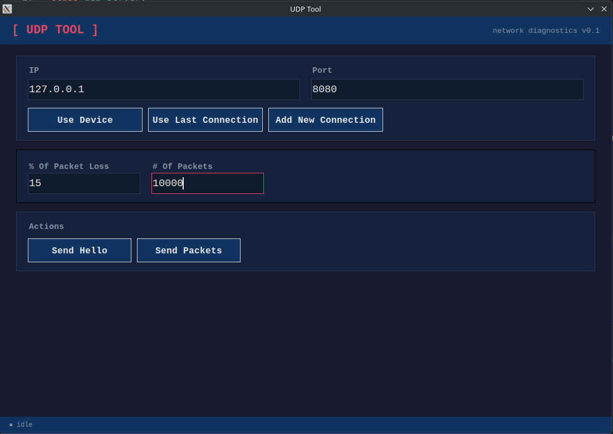

# Python UDP Benchmarking Tool
#### Kevin Russel — May 31, 2026



## Overview

A UDP server and client benchmarking tool built to explore the limits of UDP packet delivery in Python. This project stress tests a UDP receiver by hammering it with packets at scale and measuring real world drop rates, latency, and threading performance.

## What This Project Explores

- **UDP packet structure** — custom binary headers using `struct` pack/unpack with sequence numbers and timestamps
- **Kernel receive buffer behavior** — how the OS silently drops packets when the socket buffer overflows, and how `SO_RCVBUF` tuning affects drop rates
- **Python threading models** — evolution from single threaded to `threading.Thread` per packet to `ThreadPoolExecutor` with a fixed worker pool
- **Real world packet loss** — measured drop rates across 100, 10,000, and 100,000 packet tests on loopback and LAN

## Key Findings
There were two tests that I conducted. One was to measure UDP packet drop when it was on the same device. And the other was to measure packet drop when it was on the same network.

### TLDR takeway: 
Loopback UDP is predictable and only drops under extreme volume. Network UDP introduces non-deterministic drop behavior where smaller sends can drop more than larger ones, demonstrating why application level reliability mechanisms are necessary for production UDP usage.

---
### Same Device Results
| Packets Sent | Packets Received | Drop Rate |
|---|---|---|
| 100 | ~100 | 0% |
| 1000 | ~1000 | 0% |
| 10,000 | ~10,000 | 0% |
| 60,000 | ~32,000 | ~53% |

### Different Device Results.
| Packets Sent | Packets Received | Drop Rate |
|---|---|---|
| 100 | ~100 | 0% |
| 1000 | ~820 | 82% |
| 10,000 | ~10,000 | 0% |
| 20,000 | ~7,800 | 39% |
| 30,000 | ~26,000 | 86% |
| 60,000 | ~29,800 | ~49.6% |

> Increasing the socket receive buffer from the default 208KB to 4MB via `setsockopt()` significantly reduced drop rates by giving the kernel more room to buffer incoming packets before the application drains them.

## How It Works

```
Sender ──► hammers N packets at wire speed
                │
                ▼
       Kernel receive buffer (4MB)
                │
                ▼
       recvfrom() loop (main thread)
                │
                ▼
       ThreadPoolExecutor (8 workers)
                │
                ▼
       unpack header ──► calculate latency ──► return result
```

Each packet carries a custom 10 byte binary header:

```
[ 2 bytes: packet number ][ 8 bytes: timestamp (double) ][ payload ]
packed with struct format "!Hd"
```

## Setup & Usage

```bash
# clone the repo
git clone https://github.com/kevinrussell/udp-tool

# run the server
python server.py

# run the client (in a separate terminal)
python client.py --packets 10000
```

## What I Learned

- UDP drops packets **silently** at the kernel level with no notification to sender or receiver
- `print()` statements inside a hot receive loop are a major bottleneck under load
- Spawning a new thread per packet causes thread explosion — a fixed `ThreadPoolExecutor` is the correct pattern
- The GIL means Python threads run **concurrently, not in parallel** — but concurrency is enough to keep the receive loop lean
- Socket buffer size (`SO_RCVBUF`) is capped by the OS (`rmem_max`) regardless of what you request in code

## Tech Stack

- Python 3
- `socket` — UDP server and client
- `struct` — binary packet header packing
- `concurrent.futures.ThreadPoolExecutor` — fixed worker pool for packet processing
- `threading` — background worker management